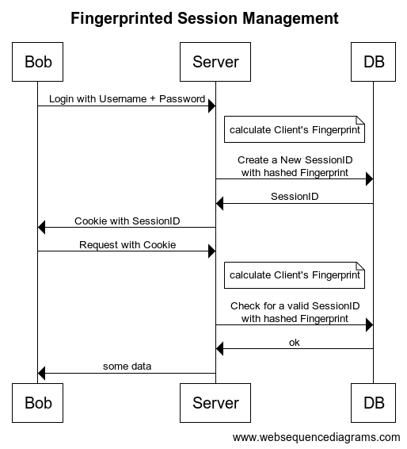

# fastify-fingerprint

<div align="center">

[](https://github.com/marcopeg/fastify-fingerprint/blob/master/LICENSE)
[](https://badge.fury.io/js/fastify-fingerprint)


</div>

Generate a header-based fingerprint for the request.

## Why?

[Fingerprinting](https://en.wikipedia.org/wiki/Device_fingerprint) is often considered a shady practice to invade the user's privacy without the need for cookies and cookies disclaimers.

Although this is certainly true, fingerprinting **CAN BE USED TO INCREASE A SYSTEM'S SECURITY**.

👉 [And I strongly suggest you to read through and use this practice](#safe-session-management-with-fingerprints) 👈

## Usage

```js
const fingerprint = require("fastify-fingerprint");

// Register your plugin:
fastify.register(fingerprint, { ...options });

// Use the fingerprint in your request handlers:
fastify.route({
  method: "GET",
  url: "/fingerprint",
  handler: (request, reply) => {
    reply.send(`ClientID: ${request.fingerprint}`);
  },
});
```

---

## Options

### requestKey

Let you customize the request key that gets the fingerprint value.

```
type:    String
default: "fingerprint"
```

### acceptHeaders

Let you customize which headers to accept in the fingerprint.

> Default values comes [from here](https://privacycheck.sec.lrz.de/passive/fp_hs/fp_header_signature.php).

```
type:    [String!]
default: see src/filter-headers.js
```

### extendHeaders

Let you extend the default list of headers with new ones:

```
type:    [String!]
```

Example:

```js
const fingerprint = require("fastify-fingerprint");

fastify.register(fingerprint, {
  extendHeaders: ["x-foobar", "x-hohoho"],
});
```

### hashFn

Let you customize the hash function.

> By default we use Crypto.

```
type:    Function
default: see src/hash.js
```

---

## Contribute & Develop

Please contribute to this library by running test, adding features and fixing bugs 🙏.

```js
npm install
npm run tdd
```

---

## Safe Session Management with Fingerprints

Here is a slightly more detailed explanation how to use this plugin to make your sessions airtight!

### Classic Session Management

Here is an example of a normal login, or session management:


🧐 What is the risk here?

🚧 IF a potential attacker manages to steal the Session's cookie, they will be able to run authenticated malicious requests.

> You can mitigate this risk by using http-only, signed, scoped, and secure cookies.

### Fingerprinted Session Management

> A Fingerprinted Session Management bind the session to the client's fingerprint, adding a layer of security for which the attacker needs to steal the session's cookie, and to replicate all the headers that are normally sent by the client.

Here is an example of a safe login, or session management, with client's fingerprinting as an added layer of security:



The whole point is to use as much client-driven information as possibile to compute a
hashed ClientID for which **THE SAME CLIENT WILL GENERATE THE SAME HASH**.

👉 The User will send the **Session cookie AS CLAIM** to use a particular session, but that claim
will be verified with the fingerprint as so to **make sure it COMES FROM THE SAME REQUESTER**.

🔥 Even a small change in the client's sent headers will produce a different ClientID
and therefore invalidate the Session.

> This strategy is very similar to what is used for validating online banking transaction,
> or digital signatures.

### Even Stronger

A possible way to make this airtight works as follow:

1. The server generates at boot time a list of randomic key/values that are sent
   out **as response headers**
2. The client always sends back all those informations **as request headers**
3. The server randomly chooses at boot time **some** of those headers and includes
   them in the fingerprint calculation
4. Every time a session is validated, the random values rotates, and the Session's
   fingerprint is updated in the DB

😎 With this stratagem in place, even if the attacker is able to steal every header
from the user's browser, they will still constantly rotate so the attacker will never be able to replay a valid set of headers.

> The only possibility for a session spoofing, is for the attackeR to aim a gun to your
> head and phisically steal your user's keyboard!!!
